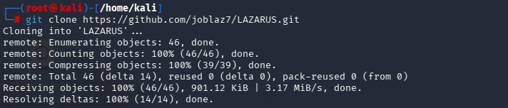
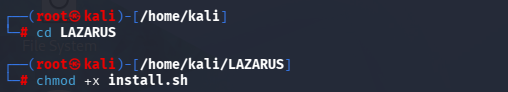
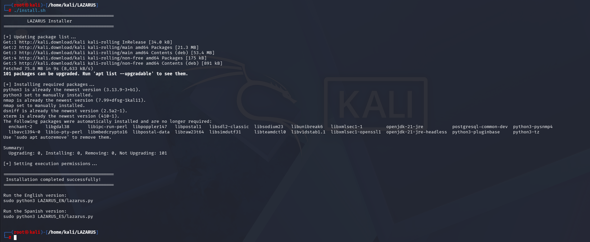
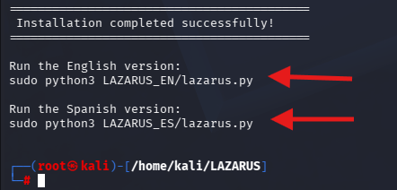
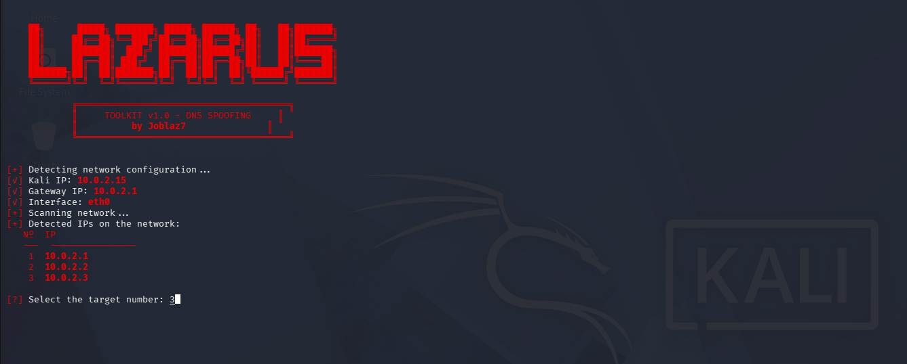
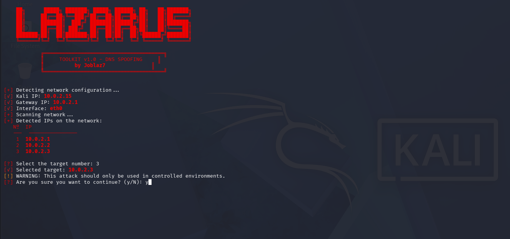
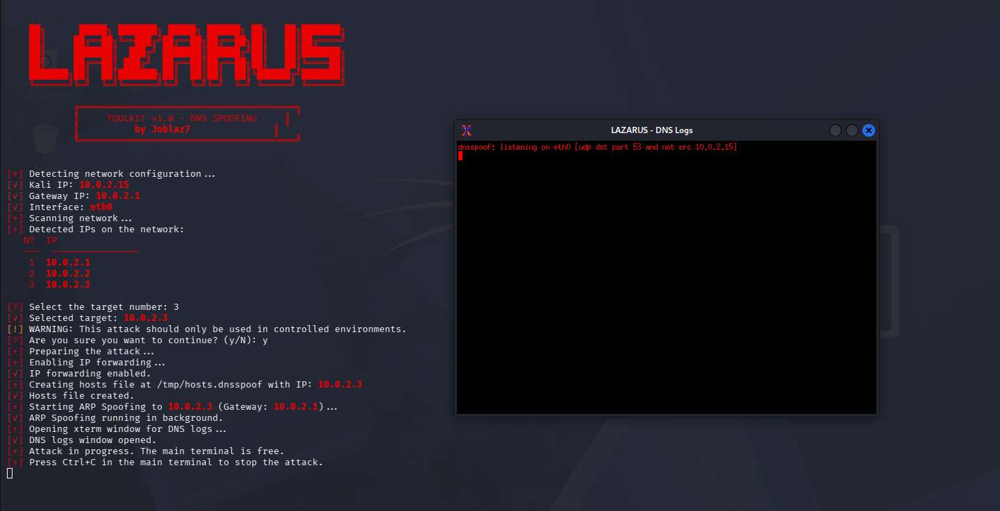
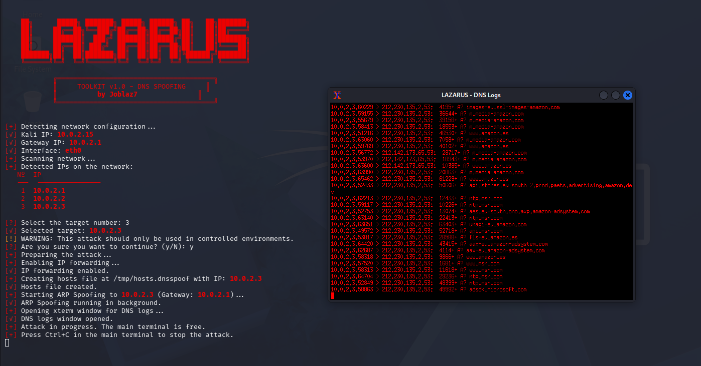

  

*A Python-based toolkit for educational cybersecurity laboratories.*

---

## 📖 Overview

LAZARUS is a Python-based toolkit designed for educational purposes, cybersecurity laboratories, and authorized security assessments.

It provides an interactive command-line interface for demonstrating DNS spoofing concepts in controlled environments while simplifying the workflow through an intuitive interface.

---

## ✨ Features

- Interactive command-line interface
- Automatic local network discovery
- Automatic gateway detection
- Interactive target selection
- Automatic cleanup on exit
- English and Spanish versions included
- Designed for Linux environments

---

## 🧪 Tested Environment

LAZARUS has been developed and tested in a controlled virtual laboratory.

### Recommended Environment

| Component | Configuration |
|-----------|---------------|
| Operating System | Kali Linux |
| Python | Python 3 |
| Virtualization | VMware Workstation / VirtualBox |
| Network Mode | NAT |
| Machines | Two virtual machines connected to the same NAT network |

The toolkit has been successfully tested in this configuration and this is the recommended environment for using the project.

---

## ⚠️ Known Limitations

The behaviour of the toolkit may vary depending on the network configuration.

Some users may experience unexpected behaviour when using:

- Bridged networking
- Corporate or managed networks
- Client isolation
- Different virtualization platforms
- Custom firewall configurations

> **Recommendation**
>
> For the most reliable results, use **two virtual machines connected through the same NAT network**.

---

## 📸 Project Walkthrough

### 1. Clone the repository

git clone https://github.com/joblaz7/LAZARUS.git

Clone the project from GitHub.

### 2. Run the installer

cd LAZARUS
chmod +x install.sh

Enter the project directory and grant execution permissions.

### 3. Installation completed

./install.sh

Install all required dependencies

sudo python3 LAZARUS_EN/lazarus.py

sudo python3 LAZARUS_ES/lazarus.py

 Once the installation finishes, choose the language version you want to run.

### 4. Target selection

LAZARUS automatically detects the network interface, local IP address, default gateway, and scans the local subnet for available hosts.
Select the target from the list of detected hosts.

### 5. Confirmation

Before starting, LAZARUS asks for confirmation to ensure the operation is intentional.

### 6. Toolkit running

After confirmation, the toolkit prepares the environment, enables IP forwarding, starts the required services, and opens a separate DNS log window.

The main terminal remains available while the toolkit is running.

### 7. DNS activity

The DNS log window displays intercepted DNS requests in real time.

---

## 📦 Requirements

- Python 3
- Kali Linux *(recommended)*
- nmap
- dsniff
- xterm

---

## ⚖️ Disclaimer

This project has been developed exclusively for educational purposes, cybersecurity training, and authorized security assessments carried out in controlled laboratory environments.

Users are solely responsible for ensuring they have appropriate authorization before using this software.

The author assumes no responsibility for any misuse of this project or for any direct or indirect damage resulting from unauthorized or unlawful use.

---

## 📄 License

This project is released under the **MIT License**.

---

## 👨‍💻 Author

Developed by **Joblaz7**
